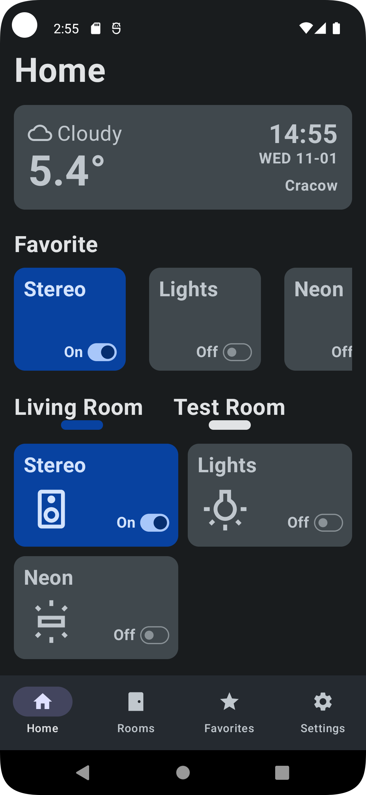
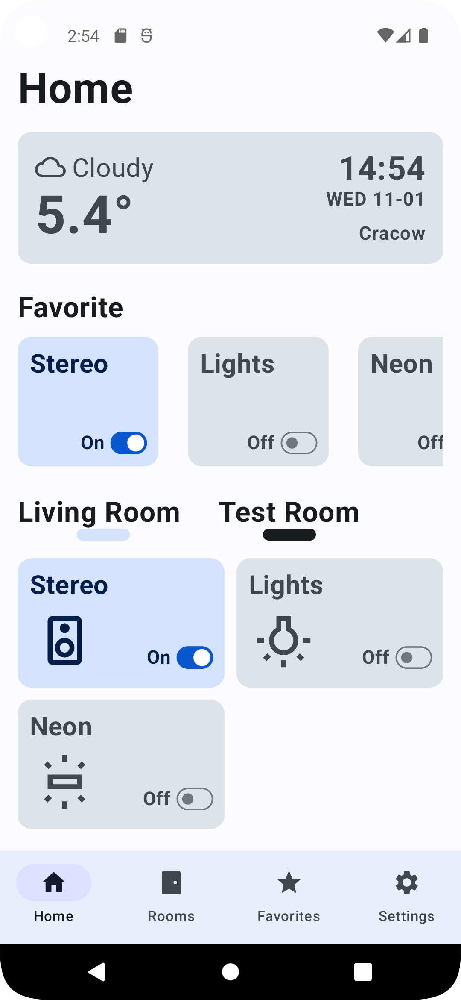
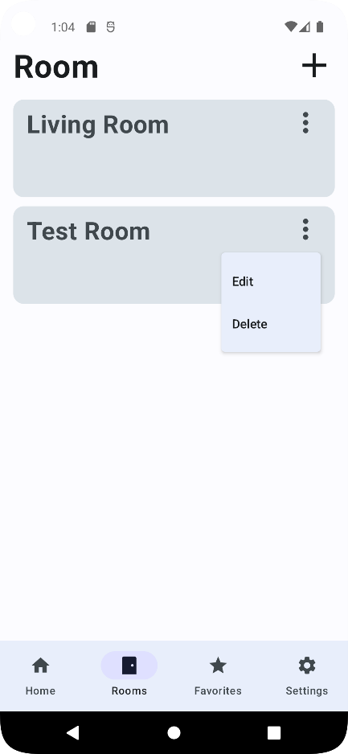
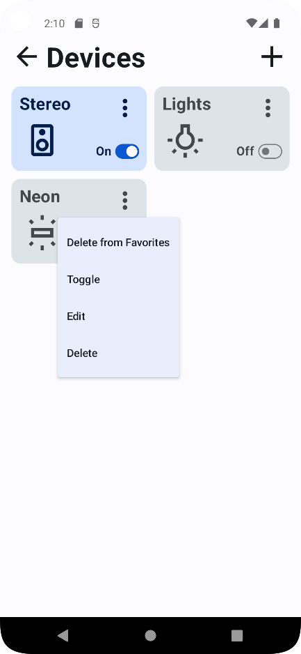
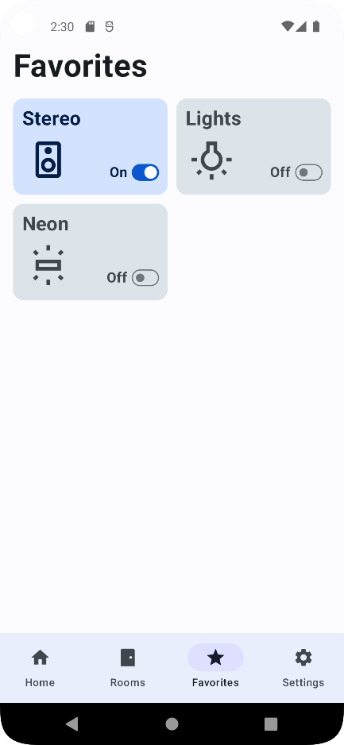
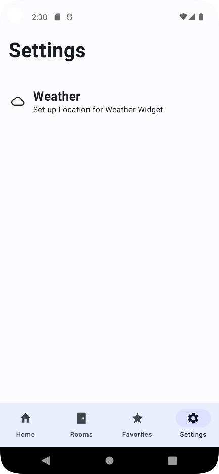

# AutoHouseMobileApp

### A Smart Home Application for Android written in Kotlin that uses the AutoHouseBackEnd API.

A smart home app for Android. It uses the Rest API to control home appliances. Application includes Home Screen as well as Rooms, Favorite and Settings Screens. These screens allows user to control, add, delete and edit saved in database rooms and devices. Additionally it displays information about current weather and time in a designated place.

## Technology Stack

* Kotlin
* Jetpac Compose
* Kotlin Coroutines
* Jetpac Navigation
* Retrofit
* MVVM Architecture
* Material Design 3
* Android Studio

 
 

##  UI

